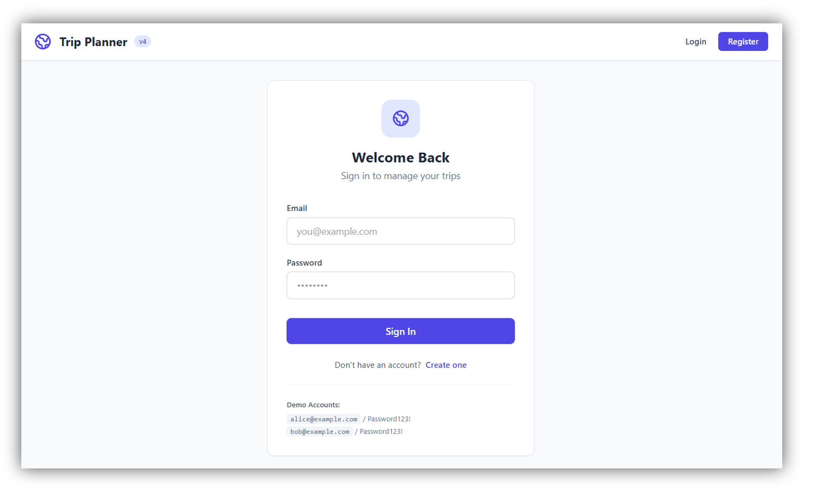

# 🧳 Trip Planner - Automation Lab (AUT)

Welcome to the **Trip Planner** project! This application serves as the primary **Application Under Test (AUT)** for our **Test Automation Engineering** training course. 

Designed to mimic real-world software evolution, this project starts as a simple Minimum Viable Product (MVP) and gradually incorporates new capabilities, architecture changes, and realistic QA challenges across course modules.

---

## 📸 Application Preview

<p align="center">
  
</p>

---

## 🎯 Purpose of This Project

During this course, you will use this application to practice hands-on test planning, designing, and writing automated test suites using modern LLM tools, framework patterns, and automation techniques.

Key topics covered throughout the project lifecycle include:
- **UI & DOM Automation** (Locators, dynamic UI states, form validation)
- **REST API Testing** (Endpoints, HTTP status codes, payloads, error handling)
- **Authentication & Session Handling**
- **Mobile & Responsive Layout Testing**
- **Database Persistence & State Verification**
- **Performance & Load Testing**

---

## 🗺️ Project Evolution (Version Roadmap)

The application evolves through 6 distinct versions during the course:

| Version | Feature / Module Focus | Tech Stack Highlights |
| :--- | :--- | :--- |
| **`v1.0`** | **Trip Planner MVP** (Itinerary CRUD, days, activities) | HTML, Vanilla JS, Tailwind CSS, Python (FastAPI), JSON persistence |
| **`v2.0`** | **User Authentication** | Registration, Login, Session/JWT handling |
| **`v3.0`** | **Budget & Expenses** | Cost tracking, trip financial summary |
| **`v4.0`** | **Travel Journal** | Travel notes, logs, diary entries |
| **`v5.0`** | **Mobile Optimization** | Responsive views, mobile-friendly UI automation |
| **`v6.0`** | **Database Migration & Performance** | SQLite persistence, high-load & stress scenario |

---

## 📦 How to Access Course Versions

Each version of the application corresponds to a specific stage in the course.

To download the source code for a specific version:
1. Navigate to the [**Releases**](https://github.com/YOUR_USERNAME/trip-planner/releases) tab on the right side of this repository.
2. Select the release version assigned in your current module (e.g., `v1.0`, `v2.0`).
3. Download the **Source code (zip)** file under **Assets**.
4. Extract the zip file locally on your machine and follow the instructions inside that version's specific `README.md`.

---

## 🚀 Quick Start (General Setup)

Each version comes with its own isolated environment requirements. The general steps to run any version locally are:

### Prerequisites
- **Python 3.10+** installed on your system.
- A modern web browser (Chrome, Firefox, or Edge).

### Running the Application Locally
1. **Navigate to the project root directory**:
```bash
   cd trip-planner
```
2. **Create and activate a virtual environment**:
   - On Windows:
```cmd
     python -m venv venv
     venv\Scripts\activate
```
   - On macOS/Linux:
```bash
     python3 -m venv venv
     source venv/bin/activate
```
3. **Install dependencies**:
```bash
   pip install -r requirements.txt
```
4. **Start the backend server**:
```bash
    cd backend
    uvicorn main:app --reload --host 0.0.0.0 --port 8000
```
5. **Open the application**:
   Open your browser and navigate to `http://localhost:8000`.

---

